# Add Two Numbers

Segundo ejercicio en Leetcode

## 📝 Enunciado

> **You are given two non-empty linked lists representing two non-negative integers. The digits are stored in reverse order, and each of their nodes contains a single digit. Add the two numbers and return the sum as a linked list.**

## 🔧 Conceptos Clave

## 🔗 Linked Lists - Conceptos Fundamentales

### 📚 ¿Qué es una Linked List?

Una **Linked List** es una estructura de datos **lineal** compuesta por **nodos** que se conectan entre sí mediante **punteros**. Cada nodo contiene:

- **Datos**: El valor almacenado
- **Puntero/Referencia**: Dirección del siguiente nodo

```mermaid
graph LR
    A["🏠 Head<br/>Node 1<br/>Data: A"] --> B["📦 Node 2<br/>Data: B"]
    B --> C["📦 Node 3<br/>Data: C"]
    C --> D["🏁 Tail<br/>Node 4<br/>Data: D"]
    D --> E["❌ NULL"]
    
    style A fill:#e1f5fe
    style D fill:#fff3e0
    style E fill:#ffebee
```

### 🆚 Linked List vs Arrays

| Característica | Array | Linked List |
|----------------|-------|-------------|
| **Memoria** | Contigua | No contigua |
| **Acceso** | O(1) por índice | O(n) secuencial |
| **Inserción** | O(n) (shift elements) | O(1) (change pointers) |
| **Eliminación** | O(n) (shift elements) | O(1) (change pointers) |
| **Tamaño** | Fijo (estático) | Dinámico |

```mermaid
graph TD
    subgraph "🗂️ Array en Memoria"
        A1["[0] A"] --- A2["[1] B"] 
        A2 --- A3["[2] C"]
        A3 --- A4["[3] D"]
    end
    
    subgraph "🔗 Linked List en Memoria"
        L1["Node A<br/>📍 0x1000"] -.->|pointer| L2["Node B<br/>📍 0x2050"]
        L2 -.->|pointer| L3["Node C<br/>📍 0x1500"]
        L3 -.->|pointer| L4["Node D<br/>📍 0x3000"]
    end
```

